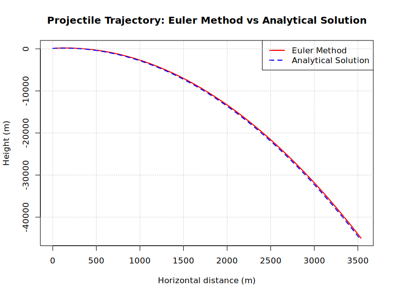

# Comparing Iteration Methods Via Celestial Dynamics

A numerical simulation suite for comparing different time-stepping methods by tracing gravitational dynamics of celestial bodies.
Implemented entirely in **R** (with some supporting Python).

📘 For method descriptions, see [THEORY.md](THEORY.md)

📊 For results and evaluations, see [RESULTS.md](RESULTS.md)

---

## Overview

This project explores the accuracy of common numerical iteration techniques, by simulating gravitational systems and observing trajectory divergence over time.

**Iteration Techniques Included**:
- Euler method
- Midpoint method
- Heun's method
- Runge-Kutta (RK4) method

Using an initial set of conditions, each method approximates the position and velocity of bodies over small time steps.
Repeated iterations generate projectile trajectories or orbital paths, which can be compared visually and analytically.
Plots and total energy conservation are used to directly compare the iteration techniques.

**Simulations include:**
- 📍 A projectile launched on Earth's surface
- 🌍 Earth-Sun orbit modeling
- 🌕 Earth-Moon system with inter-body forces
- 🪐 Three-body problems (e.g: figure-8 solution)

## 🧠 Why This Matters

Different numerical integration methods accumulate error differently.
This repository illustrates:
- **How fast energy errors grow** for different methods
- The **visual impact** of method inaccuracy
- Predictions of orbital dynamics
- A glimpse into the complexity of the chaotic three-body problem
- A techniques analytically find solutions to the three-body problem

## Project Structure

```
Celestial_Dynamics_Iteration_Methods/
├── LICENSE                           # MIT license
├── README.md                         # This file
├── THEORY.md                         # Theoretical background and equations
├── RESULTS.md                        # Results, conclusions, and evaluation
├── constants.R                       # Physical constants
├── iteration_methods/                # Numerical integration methods directory
├── celestial_systems/                # Massive body system dynamics
│   ├── three_body/                   # Three massive celestial chaos
│   │   ├── figure_8_solution.py      # Generates the initial conditions for figure-8 solution
│   │   └── three_body_runge_kutta.R  # Evolves three masses using the RK4 method only
│   └── two_body/                     # Celestial pair dynamics using each method
├── images/                           # Visual outputs and plots for all examples
└── examples/                         # Simulation examples
    ├── projectile_trajectories/
    │   └── projectile_example.R      # Runs all methods for the same projectile example
    ├── three_body_examples/          # Simple three-body system examples
    │   ├── earth_mars_sun.R
    │   ├── earth_moon_spacecraft.R
    │   └── three_earths.R            # Attempt at generating the figure-8 solution
    └── two_body_examples/
        ├── earth_moon_examples/      # Earth and Moon examples for each method
        └── sun_earth_examples/       # Sun and Earth examples for each method
```

## Installation

```bash
# Clone the repository
git clone https://github.com/SidRichardsQuantum/Celestial_Dynamics_Iteration_Methods.git
cd Celestial_Dynamics_Iteration_Methods
```

### Example Usages

```r
# Projectile trajectory on Earth
# Approximated trajectory plotted alongside the real trajectory
# Returns a plot for each method
source("examples/projectile_trajectories/projectile_example.R")
```


```r
# Compare methods for Earth-Moon system using the Euler method
source("examples/two_body_examples/earth_moon_examples/earth_moon_euler.R")
```


---

📘 Author: Sid Richards (SidRichardsQuantum)

 LinkedIn: https://www.linkedin.com/in/sid-richards-21374b30b/

This project is licensed under the MIT License - see the [LICENSE](LICENSE) file for details.
