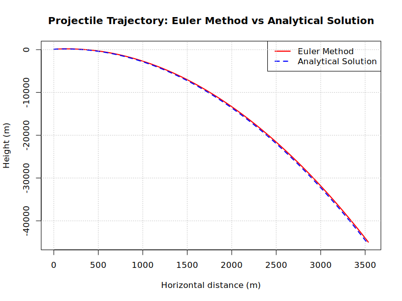
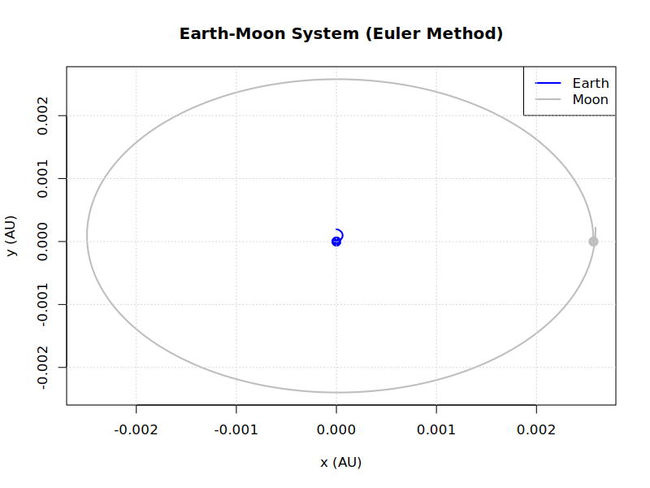

# Comparing Iteration Methods Via Celestial Dynamics

A numerical simulation suite for comparing different time-stepping methods by tracing gravitational dynamics of celestial bodies.
Implemented primarily in **R**, with an optional Python helper for regenerating figure-8 initial conditions.

📘 For method descriptions, see [THEORY.md](THEORY.md)

📊 For results and evaluations, see [RESULTS.md](RESULTS.md)

## Table of Contents

- [Overview](#overview)
- [🧠 Why This Matters](#-why-this-matters)
- [Project Structure](#project-structure)
- [Installation](#installation)
  - [Example Usages](#example-usages)

---

## Overview

This project explores the accuracy of common numerical iteration techniques, by simulating gravitational systems and observing trajectory divergence over time.

**Iteration Techniques Included**:
- Euler method
- Midpoint method
- Heun's method
- Runge-Kutta (RK4) method

> Note: `constants.R` defines `G` as positive; force equations include explicit negative signs for attraction.

Using an initial set of conditions, each method approximates the position and velocity of bodies over small time steps.
Repeated iterations generate projectile trajectories or orbital paths, which can be compared visually and analytically.
Plots and total energy conservation are used to directly compare the iteration techniques.

**Simulations include:**
- 📍 A projectile launched on Earth's surface
- 🌍 Earth-Sun orbit modeling
- 🌕 Earth-Moon system with inter-body forces
- 🪐 Three-body problems (e.g: figure-8, Lagrange, and Euler solutions)

## 🧠 Why This Matters

Different numerical integration methods accumulate error differently.
This repository illustrates:
- **How fast energy errors grow** for different methods
- The **visual impact** of method inaccuracy
- Predictions of orbital dynamics
- A glimpse into the complexity of the chaotic three-body problem
- How numerical techniques can help analytically informed exploration of three-body solutions

## Project Structure

```
Celestial_Dynamics_Iteration_Methods/
├── LICENSE                           # MIT license
├── README.md                         # This file
├── THEORY.md                         # Theoretical background and equations
├── RESULTS.md                        # Results, conclusions, and evaluation
├── constants.R                       # Physical constants
├── iteration_methods/                # Numerical integration methods directory
├── celestial_systems/                # Massive body system dynamics
│   ├── three_body/                   # Three massive celestial chaos
│   │   ├── choreography_initial_conditions.R # Scales cataloged equal-mass choreographies
│   │   ├── circular_restricted_three_body.R # Normalized CR3BP helper and plots
│   │   ├── euler_collinear_initial_conditions.R # Scales the equal-mass Euler collinear solution
│   │   ├── figure_8_initial_conditions.R # Scales standard figure-8 initial conditions
│   │   ├── figure_8_solution.py      # Optional helper to regenerate figure-8 initial conditions
│   │   ├── lagrange_initial_conditions.R # Scales the equal-mass Lagrange triangle solution
│   │   ├── plot_three_body.R         # Shared plotting helper for three-body examples
│   │   ├── sitnikov_problem.R        # Restricted 3D Sitnikov problem helper
│   │   └── three_body_runge_kutta.R  # Evolves three masses using the RK4 method only
│   └── two_body/                     # Celestial pair dynamics using each method
├── images/                           # Visual outputs and plots for all examples
├── examples/                         # Simulation examples
│   ├── projectile_trajectories/
│   │   └── projectile_example.R      # Runs all methods for the same projectile example
│   ├── three_body_examples/          # Three-body examples grouped by model type
│   │   ├── README.md                 # Three-body example index
│   │   ├── run_all_three_body_examples.R
│   │   ├── general/                  # Full-mass physical and astrophysical systems
│   │   ├── perturbations/            # Perturbed special solutions
│   │   ├── restricted/               # CR3BP and Sitnikov examples
│   │   └── special_solutions/        # Periodic equal-mass solutions
│   └── two_body_examples/
│       ├── earth_moon_examples/      # Earth and Moon examples for each method
│       └── sun_earth_examples/       # Sun and Earth examples for each method
└── tests/
    └── validate_three_body.R         # Regression checks for special three-body solutions
```

## Installation

```bash
# Clone the repository
git clone https://github.com/SidRichardsQuantum/Celestial_Dynamics_Iteration_Methods.git
cd Celestial_Dynamics_Iteration_Methods

# Optional: install Python dependencies for the figure-8 helper script
python -m pip install -r requirements.txt
```

The R examples run with base R. The optional Python helper
`celestial_systems/three_body/figure_8_solution.py` requires the Python packages
listed in `requirements.txt`.

Run the three-body validation check with:

```bash
Rscript tests/validate_three_body.R
```

Regenerate all three-body example plots with:

```bash
Rscript examples/three_body_examples/run_all_three_body_examples.R
```

### Example Usages

```r
# Projectile trajectory on Earth
# Approximated trajectory plotted alongside the real trajectory
# Returns a plot for each projectile method (Euler, Heun, Midpoint)
source("examples/projectile_trajectories/projectile_example.R")
```


```r
# Compare methods for Earth-Moon system using the Euler method
source("examples/two_body_examples/earth_moon_examples/earth_moon_euler.R")
```


```r
# Run one special three-body solution
source("examples/three_body_examples/special_solutions/three_earths.R")
```


---

📘 Author: Sid Richards (SidRichardsQuantum)

 LinkedIn: https://www.linkedin.com/in/sid-richards-21374b30b/

This project is licensed under the MIT License - see the [LICENSE](LICENSE) file for details.
