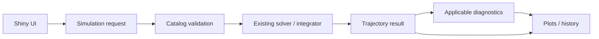

# Comparing Iteration Methods Via Celestial Dynamics

[](https://github.com/SidRichardsQuantum/Celestial_Dynamics_Iteration_Methods/actions/workflows/r-validation.yml)
[](https://github.com/SidRichardsQuantum/Celestial_Dynamics_Iteration_Methods/actions/workflows/pages.yml)
[](https://sidrichardsquantum.r-universe.dev/CelestialDynamicsIterationMethods)
[](https://sidrichardsquantum.r-universe.dev/CelestialDynamicsIterationMethods)

A numerical simulation suite for comparing time-stepping methods by tracing gravitational dynamics of projectiles, two-body systems, and three-body systems.
The project is implemented primarily in R, with an optional Python helper for regenerating figure-8 initial conditions.

**Website:**
[https://sidrichardsquantum.github.io/Celestial_Dynamics_Iteration_Methods/](https://sidrichardsquantum.github.io/Celestial_Dynamics_Iteration_Methods/)

**R-universe:**
[https://sidrichardsquantum.r-universe.dev/CelestialDynamicsIterationMethods](https://sidrichardsquantum.r-universe.dev/CelestialDynamicsIterationMethods)

## Overview

This project compares:

- Euler method
- Midpoint method
- Heun's method
- Runge-Kutta (RK4) method
- Velocity Verlet method

The simulations generate trajectories and energy-conservation diagnostics for:

- projectile motion near Earth's surface
- same-system comparisons across all implemented methods
- Sun-Earth and Earth-Moon two-body systems
- general n-body systems
- special four-body central configurations
- general three-body systems
- special three-body solutions, including figure-8, Lagrange, Euler collinear, and Butterfly I
- restricted three-body examples, including CR3BP and Sitnikov cases

`R/constants.R` defines `G` as positive; attraction is handled by explicit signs in the force equations.

## Installation

Install the development package directly from GitHub:

```r
install.packages("remotes")
remotes::install_github("SidRichardsQuantum/Celestial_Dynamics_Iteration_Methods")
```

After R-universe has built the package, install from R-universe:

```r
options(repos = c(
  sidrichardsquantum = "https://sidrichardsquantum.r-universe.dev",
  CRAN = "https://cloud.r-project.org"
))
install.packages("CelestialDynamicsIterationMethods")
```

R-universe setup notes and the registry details are in
[docs/R_UNIVERSE.md](docs/R_UNIVERSE.md).

## Common Commands

Install the optional Studio dependencies to run the full validation suite:

```bash
Rscript -e 'install.packages(c("shiny", "jsonlite", "callr"), repos="https://cloud.r-project.org")'
Rscript tests/run_all_tests.R
```

Regenerate every example plot:

```bash
Rscript run_all_examples.R
```

Regenerate analysis tables, diagnostics, and the dashboard:

```bash
Rscript analysis/generate_results.R
```

For source checkouts, example-specific commands, optional Python setup, and
generated artifact details, see [docs/USAGE.md](docs/USAGE.md).

## Documentation

- [Usage](docs/USAGE.md): setup, commands, examples, repository layout, and generated artifacts
- [Theory](docs/THEORY.md): method descriptions and numerical context
- [Results](docs/RESULTS.md): generated results, evaluation, and comparison dashboards
- [R-universe setup](docs/R_UNIVERSE.md): package registry and install details

## Repository Highlights

- `DESCRIPTION` and `NAMESPACE`: lightweight R package metadata
- `R/load.R`: project-root-aware loading helpers used by scripts and tests
- `R/methods/`: projectile-oriented method implementations
- `R/systems/two_body/`: two-body solvers, method registry, and shared plotting/physics helpers
- `R/systems/n_body/`: general 2D n-body RK4 and Velocity Verlet engines
- `R/systems/three_body/`: full and restricted three-body helpers
- `examples/`: runnable examples grouped by model type, including method comparisons
- `images/`: generated plots grouped by example type
- `analysis/`: reproducible result-table, diagnostic-plot, and dashboard generation
- `docs/`: usage, theory, and canonical results narrative
- `tests/`: validation scripts used locally and in CI
- `.github/workflows/`: validation, plot-regeneration, and GitHub Pages deployment workflows

## Celestial Dynamics Studio

An [optional experiment planner](docs/EXPERIMENT_PLANNING.md) accepts
provider-neutral natural-language proposals or plan JSON, validates them against
the actual catalogue, and requires review before loading the composer. It is
disabled by default. Only the existing numerical engine computes trajectories
and diagnostics; no AI provider or generated code runs as part of normal Studio.

The opt-in [experimental periodic-orbit workflow](docs/PERIODIC_ORBITS.md)
adds safeguarded shooting correction, full iteration history and independent
resolution checks. Start with the known figure-eight example through the R API
or **Advanced: periodic orbits** in Studio. It makes no new-orbit discovery claims
and does not change the core simulation runner.

An optional interactive R Shiny app wraps the existing numerical physics with a
simulation catalog, editable initial conditions, integrator comparisons,
diagnostics, animations, exports, and local run history. Shiny keeps the app in
the same language as the solvers and reuses the repository's plotting utilities.

From a source checkout with R 4.1 or newer:

```bash
Rscript -e 'install.packages(c("shiny", "jsonlite", "callr"), repos="https://cloud.r-project.org")'
Rscript -e 'shiny::runApp("app", launch.browser=TRUE)'
```

`shiny`, `jsonlite` and `callr` are optional `Suggests` dependencies. Existing
solvers and the synchronous simulation API need none of them. JSON history needs
`jsonlite`; background jobs need `callr`.
The entry point is `app/app.R`.

| Simulation | Compatible integrators | Units |
| --- | --- | --- |
| Two-body (2D) | Euler, Midpoint, Heun, RK4, Verlet | SI |
| General three-body (2D) | RK4 | SI |
| N-body (2D) | RK4, Verlet | SI |
| Restricted three-body / CR3BP (3D) | RK4 | Normalized rotating frame |
| Circular Sitnikov (3D geometry) | RK4 | SI |

Nineteen presets include circular/eccentric Sun-Earth, Earth-Moon and equal-mass
binaries, figure-eight, Lagrange triangle, Euler collinear, Butterfly I,
Pythagorean, Earth-Moon L4/L5 Trojans, a retrograde lunar test particle,
Sun-Jupiter test particle, Solar System, binary stars with a companion,
square/triangular four-body configurations, and two Sitnikov amplitudes.
Pythagorean runs through its first close encounter using 100,000 RK4 steps;
its default is checked for conservation and timestep convergence. Select multiple compatible integrators to compare
the same initial conditions, trajectories, applicable conservation errors, and
elapsed runtimes. These timings are illustrative, not rigorous benchmarks.
The [Integrator Lab](docs/INTEGRATOR_LAB.md) adds per-method timesteps, an explicit
reference, separate position/velocity differences, conservation/error plots,
failure status, and saved comparisons linking normal history runs. Multi-method
batches open the Lab when finished; every constituent can be opened in the Viewer.
The [Convergence workflow](docs/CONVERGENCE.md) studies one integrator across
timesteps with an explicit analytic or numerical reference, error plots,
empirical orders, reusable results and saved comparisons in Studio.
The [Sensitivity workflow](docs/LYAPUNOV.md) adds nearby-trajectory analysis with
periodic renormalisation through `run_lyapunov_analysis()`. Choose epsilon,
direction or state component, metric scales, reset interval and total time.
Studio displays separation, log separation, a finite-time Lyapunov estimate and
base/companion trajectories, with cancellable background execution and RDS/CSV
downloads. Results are finite-time directional estimates, not asymptotic
exponents or automatic chaos classifications.
The [Parameter sweep framework](docs/PARAMETER_SWEEPS.md) runs bounded 1D/2D
families through the normal experiment runner, with unique run IDs, optional
history, scalar diagnostics and per-point failure metadata. Studio's **Sweeps**
tab provides range controls, line plots, heatmaps, cancellation and point-to-run
inspection. See the [runnable examples](examples/comparisons/parameter_sweeps.R)
for timestep, mass ratio, initial-state perturbations and CR3BP x/y grids.
The [dynamical model interface](docs/DYNAMICAL_MODELS.md) separates force
parameters, initial state and integration settings. N-body RK4/Verlet use its
shared numerical core while retaining their existing public interfaces.
The [CR3BP module](docs/CR3BP.md) provides rotating-frame equations, L1–L5,
Jacobi diagnostics and Earth–Moon/Sun–Earth Studio presets for the idealized
circular restricted model, with clearly marked primaries and normalized units.
All methods use fixed timesteps; duration must be an integer multiple of timestep.
The composer provides a body table for masses, positions and velocities, with
explicit units and add/remove controls for N-body systems. Advanced JSON editing
remains available and stays synchronized with the table. Live validation shows
the step count and inline input errors; Run is enabled only for valid configurations.
Runs with relative energy/Jacobi drift above 0.1% display a conservation warning.

Restricted-system animations include the named primaries and default to an inertial
view. Switch to the rotating frame and fit **Test particle** to inspect Trojan
libration. All animations offer fit, zoom, body following, time display and
replay; Sitnikov defaults to x-z so its vertical motion is visible.

```r
source("R/load.R")
cd_load_studio()
request <- studio_preset("circular_two_body")
result <- run_simulation(request)
comparison <- compare_integrators(request, c("RK4", "Verlet"))
studio_plot_diagnostic(comparison, "energy_relative_drift")
diagnostics <- simulation_diagnostics(result)
diagnostics$summary
diagnostics$performance
# Persistent workflow (requires jsonlite):
# lab <- run_integrator_comparison(request, c("RK4", "Verlet"), reference = "RK4")
# lab$metrics
```

The [diagnostics reference](docs/DIAGNOSTICS.md) documents invariant equations,
momentum and centre-of-mass drift, separations, validity and encounter checks,
relative-error safeguards, and the machine-readable report used by Studio.

Runs are versioned scientific objects using the existing `simulation_result`
class. They retain a stable ID, resolved request, trajectory, diagnostics, model
context, package/source provenance and timestamps. Favorites and tags belong to
history metadata, separate from the scientific data:

```r
summary(result)
path <- studio_save_history(result, tags = c("baseline", "two-body"))
saved <- studio_load_result(path)
repeated <- studio_rerun(saved) # new ID; parent ID identifies the original run
json <- studio_result_json(saved) # full scientific object, not just the request
restored <- studio_result_from_json(json)
```

See [the scientific run contract](docs/STUDIO.md#scientific-run-contract) for
schema compatibility, validation and reproduction limits.

The studio now follows **catalogue → composer → run → gallery → viewer → reuse → compare**.
Browse presets by system, inspect scientific trajectory cards, search by preset or
integrator, and keep favorites across sessions. The gallery shows 12 runs per page
(choose 6, 12, 24 or 48); comparison selections survive page and filter changes.
Scientific PNG previews use bounded server caching and private browser caching.
Select at least two completed
runs for trajectory and conservation comparisons; physical inputs and duration
must match, while integrator and timestep may differ.

History metadata lives in `.studio/history/<run-id>.json`. New runs also save
`<run-id>/preview.png` and `<run-id>/result.json.gz`, preserving the original
scientific result for viewing, animation and export without recomputation.
Reuse restores the saved numerical request into the composer. Older metadata-only
records still load and can be reused. Favorites persist in metadata; there is no
automatic deletion policy. Failed solver runs retain their request and error.

Run submits a batch to a separate R process so the studio stays responsive. The
newest cards show queued/running stages; **Cancel unfinished runs** stops that
session's worker and retains cancelled requests for reuse. Already completed runs
remain completed. Closing or reloading the browser session cancels its unfinished
batch. New history records use schema 4 with a stable scientific run ID; background
records retain timestamped lifecycle events. Schemas 1–3 remain readable.
See the gallery for results when a batch finishes.
Set `CELESTIAL_STUDIO_HISTORY` to change the local history directory.
See [Studio workflow and persistence](docs/STUDIO.md) for details.

From a fresh Codespace terminal at the repository root:

```bash
# If R is absent from the Codespace image:
sudo apt-get update
sudo apt-get install -y r-base r-cran-shiny r-cran-jsonlite r-cran-callr
Rscript -e 'shiny::runApp("app", host="0.0.0.0", port=8765, launch.browser=FALSE)'
```

Open port **8765** from the Codespaces **Ports** panel. If R is already installed
but optional packages are missing, use:

```bash
Rscript -e 'install.packages(c("shiny", "jsonlite", "callr"), repos="https://cloud.r-project.org")'
```


```mermaid
flowchart LR
    UI[Shiny UI] --> Request[Simulation request]
    Request --> Catalog[Catalog validation]
    Catalog --> Solver[Existing solver / integrator]
    Solver --> Result[Trajectory result]
    Result --> Diagnostics[Applicable diagnostics]
    Diagnostics --> Output[Plots / history]
    Result --> Output
```

See [Studio architecture, API and scientific conventions](docs/STUDIO.md) for the
repository audit, result schema, units, diagnostics, reproducibility, and limits.
Run all validation with `Rscript tests/run_all_tests.R`.

## License

This project is licensed under the MIT License. See [LICENSE](LICENSE).

Author: Sid Richards (SidRichardsQuantum)
