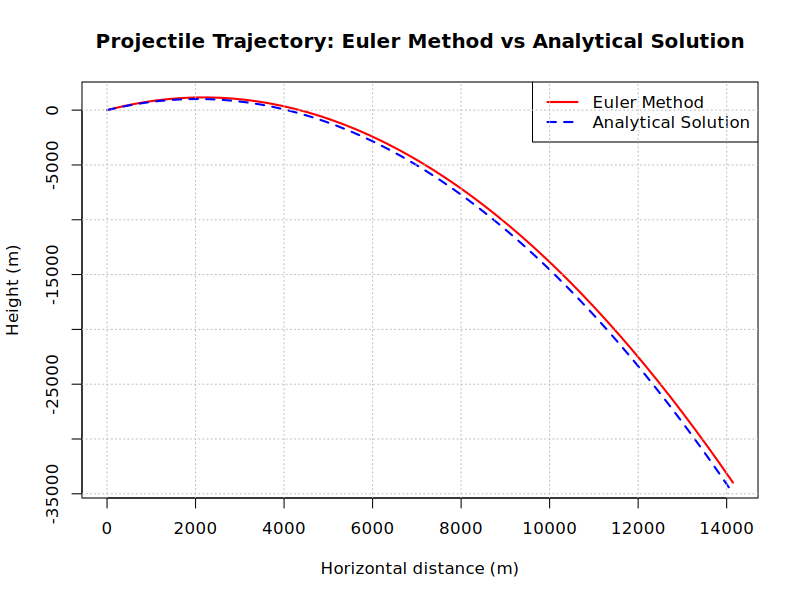
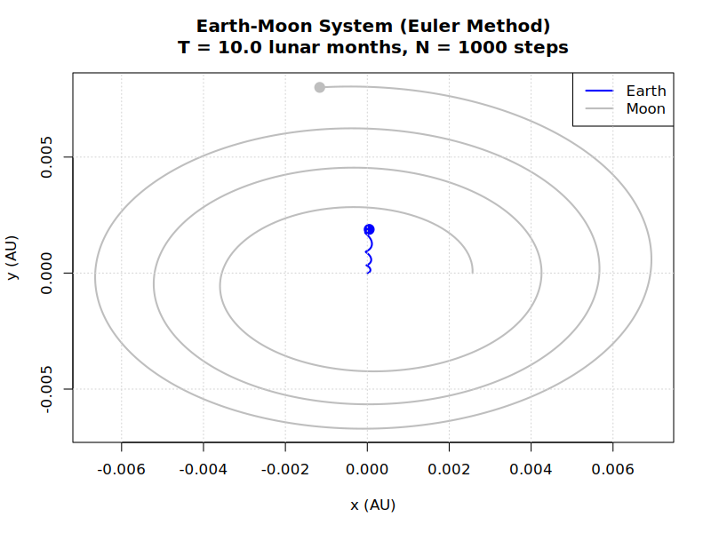

# Comparing Iteration Methods Via Celestial Dynamics
Comparing different numerical iteration techniques by tracing out gravitational dynamics of objects.
Coded entirely in R.

See [THEORY.md](THEORY.md) for complete descriptions of each iteration technique.

See [RESULTS.md](RESULTS.md) for results, conclusions and evaluations.

## Overview

**Iteration Techniques Include**:
- Euler method
- Midpoint method
- Heun's method
- Runge-Kutta method

Given an initial set of parameters, these iteration methods can be used to approximate the next coordinates after a short time step.
Repeating this thousands of times, while tracing the coordinates, we illustrate the trajectories/orbits of the projectiles/celestials.
When plotting orbits for every method, eventually the bodies spiral outwards - hence the plots (and ratio of initial to final energies) directly compare the different iteration techniques.

An example for a projectile being fired on Earth's surface is given - with analysis on the accuracies of different iteration methods.
More examples include the Sun and Earth's orbital plot, and similarly a Earth and Moon system plot.

We adapt the two-body system by introducing a third celestial, to illustrate the chaos of the three-body-problem for masses of similar sizes.

## Project Structure

```
├── LICENSE                         # Project license
├── README.md                       # This file
├── THEORY.md                       # Theoretical background and equations
├── RESULTS.md                      # Results, conclusions and evaluations
├── constants.R                     # Physical constants
├── celestial_systems/              # Gravitational system simulation
│   ├── three_body/
│   │   └── three_body_problem.R    # Three massive celestial chaos
│   └── two_body/
│       ├── two_body_euler.R        # Two-body orbits using Euler method
│       ├── two_body_midpoint.R     # Two-body orbits using midpoint method
│       ├── two_body_heuns.R        # Two-body orbits using Heun's method
│       └── two_body_runge_kutta.R  # Two-body orbits using Runge-Kutta method
├── examples/
│   ├── earth_moon_euler.R          # Earth and Moon example using Euler method
│   ├── sun_earth_euler.R           # Sun and Earth example using Euler method
│   ├── earth_mars_sun.R            # Earth, Mars and Sun example
│   └── projectile_example.R        # Projectile motion example
├── images/
│   ├── earth_moon_euler.png        # Earth and Moon orbits plot for Euler method
│   ├── sun_earth_euler.png         # Sun and Earth orbits plot for Euler method
│   ├── euler_trajectory.png        # Euler method trajectory plot
│   ├── midpoint_trajectory.png     # Midpoint method trajectory plot
│   ├── heun_trajectory.png         # Heun's method trajectory plot
│   └── rungekutta_trajectory.png   # Runge-Kutta method trajectory plot
└── iteration_methods/              # Numerical integration methods for celestial mechanics
    ├── euler_method.R              # Euler method implementation
    ├── midpoint_method.R           # Midpoint method implementation
    ├── heuns_method.R              # Heun's method implementation
    └── runge_kutta_method.R        # Runge-Kutta (RK4) method implementation
```

## Installation

```bash
# Clone and run
git clone https://github.com/SidRichardsQuantum/Celestial_Dynamics_Iteration_Methods.git
cd Celestial_Dynamics_Iteration_Methods
```

### Example Usages

```r
# Projectile trajectory on Earth
# Approximated trajectory plotted alongside the real trajectory
# Returns a plot for each method
source("examples/projectile_trajectories/projectile_example.R")
```


```r
# Compare methods for Earth-Moon system using the Euler method
source("examples/earth_moon_euler.R")
```


---

📘 Author: Sid Richards (SidRichardsQuantum)

 LinkedIn: https://www.linkedin.com/in/sid-richards-21374b30b/

This project is licensed under the MIT License - see the [LICENSE](LICENSE) file for details.
