# Results

## Table of Contents

- [Generated Analysis](#generated-analysis)
- [Comparison Examples](#comparison-examples)
- [N-Body Systems](#n-body-systems)
- [Sun-Earth System](#sun-earth-system)
  - [Euler Method](#euler-method)
  - [Midpoint Method](#midpoint-method)
  - [Heun's Method](#heuns-method)
  - [Runge-Kutta Method](#runge-kutta-method)
  - [Velocity Verlet Method](#velocity-verlet-method)
- [Three-Body Systems](#three-body-systems)
  - [Sun, Earth and Mars](#sun-earth-and-mars)
  - [Earth, Moon and Spacecraft](#earth-moon-and-spacecraft)
  - [Figure-8 Solution](#figure-8-solution)
  - [Lagrange Equilateral Solution](#lagrange-equilateral-solution)
  - [Euler Collinear Solution](#euler-collinear-solution)
  - [Perturbed Special Solutions](#perturbed-special-solutions)
  - [Restricted Earth-Moon Trojan](#restricted-earth-moon-trojan)
  - [Planar Lyapunov-Like L1 Orbit](#planar-lyapunov-like-l1-orbit)
  - [Sitnikov Problem](#sitnikov-problem)
  - [Binary with a Distant Third Body](#binary-with-a-distant-third-body)
  - [Butterfly I Choreography](#butterfly-i-choreography)
- [Conclusions](#conclusions)
- [References](#references)

## Generated Analysis

<!-- BEGIN GENERATED ANALYSIS -->
This section is generated by `Rscript analysis/generate_results.R`.
Do not edit the numeric tables by hand; regenerate them from the solver code.

### Sun-Earth Method Summary

| method | years | steps | final_separation_au | final_energy_ratio | max_abs_energy_error | max_abs_angular_momentum_drift |
| --- | --- | --- | --- | --- | --- | --- |
| Euler | 25 | 1000 | 1.02956e+01 | 1.45946e-01 | 8.54054e-01 | 1.09354e+00 |
| Midpoint | 25 | 1000 | 1.05514e+00 | 9.42958e-01 | 5.70418e-02 | 2.97638e-02 |
| Heun | 25 | 1000 | 1.21910e+00 | 8.49014e-01 | 1.50986e-01 | 8.44417e-02 |
| RK4 | 25 | 1000 | 9.99575e-01 | 1.00042e+00 | 4.21667e-04 | 2.10766e-04 |
| Verlet | 25 | 1000 | 1.00018e+00 | 9.99998e-01 | 1.38278e-04 | 2.18102e-15 |

### Sun-Earth Convergence Summary

Errors are measured against a one-year RK4 reference run with `N = 16000`.

| method | years | steps | dt_days | final_position_error_au | observed_order |
| --- | --- | --- | --- | --- | --- |
| Euler | 1 |  250 | 1.46100e+00 | 1.20694e+00 |  |
| Euler | 1 |  500 | 7.30500e-01 | 6.76416e-01 | 8.354e-01 |
| Euler | 1 | 1000 | 3.65250e-01 | 3.58832e-01 | 9.146e-01 |
| Euler | 1 | 2000 | 1.82625e-01 | 1.84827e-01 | 9.571e-01 |
| Midpoint | 1 |  250 | 1.46100e+00 | 2.37405e-03 |  |
| Midpoint | 1 |  500 | 7.30500e-01 | 5.87089e-04 | 2.016e+00 |
| Midpoint | 1 | 1000 | 3.65250e-01 | 1.45910e-04 | 2.009e+00 |
| Midpoint | 1 | 2000 | 1.82625e-01 | 3.63660e-05 | 2.004e+00 |
| Heun | 1 |  250 | 1.46100e+00 | 5.51744e-03 |  |
| Heun | 1 |  500 | 7.30500e-01 | 1.35203e-03 | 2.029e+00 |
| Heun | 1 | 1000 | 3.65250e-01 | 3.34451e-04 | 2.015e+00 |
| Heun | 1 | 2000 | 1.82625e-01 | 8.31604e-05 | 2.008e+00 |
| RK4 | 1 |  250 | 1.46100e+00 | 6.58641e-08 |  |
| RK4 | 1 |  500 | 7.30500e-01 | 3.85816e-09 | 4.094e+00 |
| RK4 | 1 | 1000 | 3.65250e-01 | 2.33057e-10 | 4.049e+00 |
| RK4 | 1 | 2000 | 1.82625e-01 | 1.43231e-11 | 4.024e+00 |
| Verlet | 1 |  250 | 1.46100e+00 | 1.32238e-03 |  |
| Verlet | 1 |  500 | 7.30500e-01 | 3.30656e-04 | 2.000e+00 |
| Verlet | 1 | 1000 | 3.65250e-01 | 8.26677e-05 | 2.000e+00 |
| Verlet | 1 | 2000 | 1.82625e-01 | 2.06671e-05 | 2.000e+00 |

### Generated Figures

- `images/analysis/sun_earth_energy_error.png`
- `images/analysis/sun_earth_angular_momentum_drift.png`
- `images/analysis/convergence_rates.png`
- `analysis/generated/method_comparison_dashboard.html`

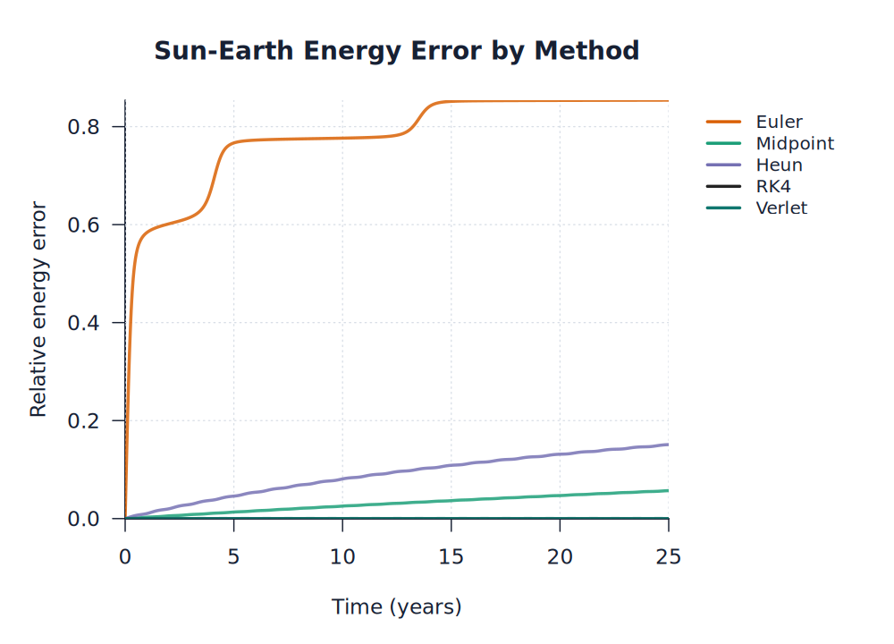

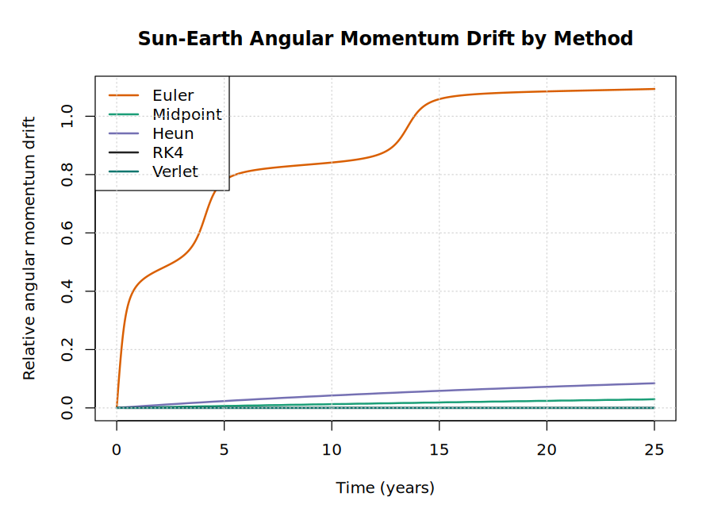

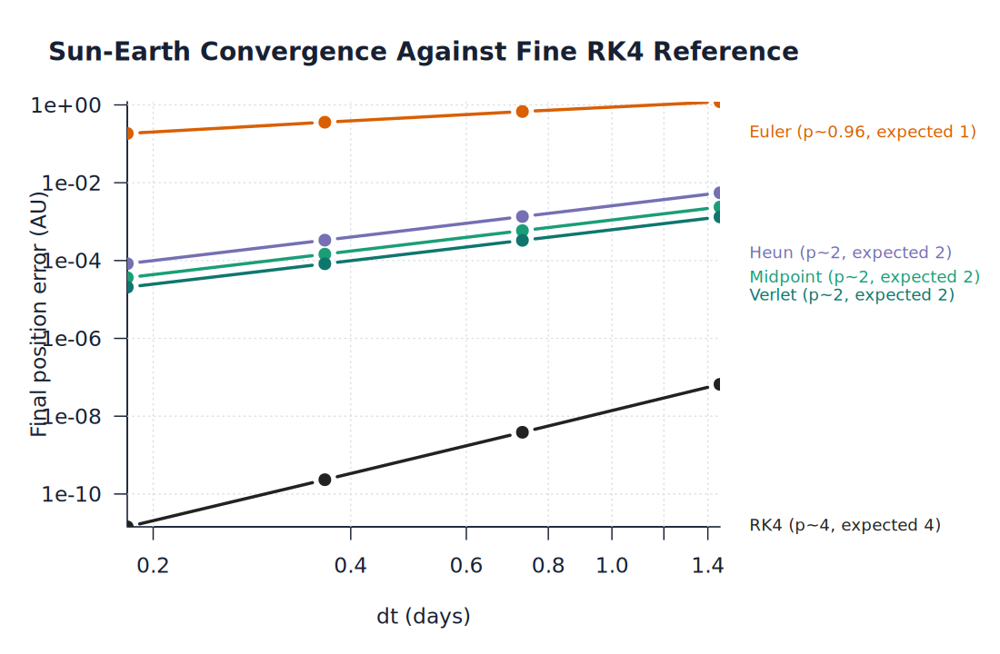
<!-- END GENERATED ANALYSIS -->

## Comparison Examples

The comparison examples run every implemented two-body method against the same
simple setup. The Sun-Earth comparison uses one year and `N = 250` steps so the
Euler method visibly drifts while Midpoint, Heun, RK4, and Velocity Verlet stay
near the expected orbit.
The method list, colors, and Sun-Earth setup are shared through
`celestial_systems/two_body/two_body_method_registry.R`.


The energy-error comparison uses an absolute relative error scale so the
higher-accuracy methods remain visible next to Euler.

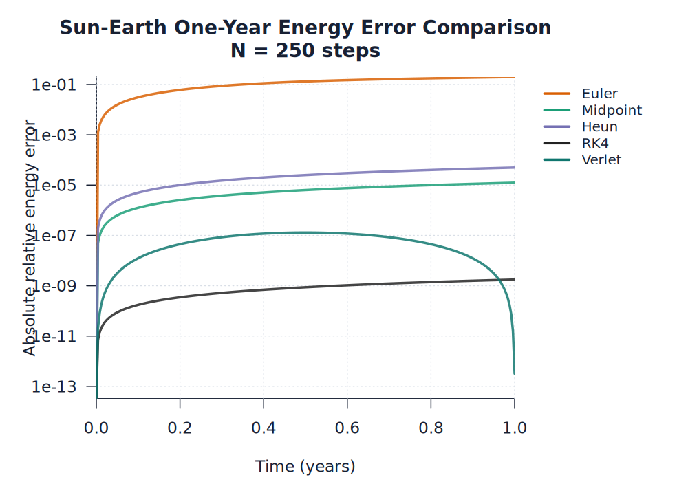

## N-Body Systems

The general n-body engine supports any number of 2D massive bodies using shared
array-based position and velocity storage.
The first example uses RK4 for a Sun-Earth-Mars-Jupiter system over 12 years.
It is intended as a compact demonstration that the repo can now run beyond
hard-coded two-body and three-body systems.


The n-body examples also include special four-body central configurations.
In these cases the shape is preserved while the bodies rotate rigidly.


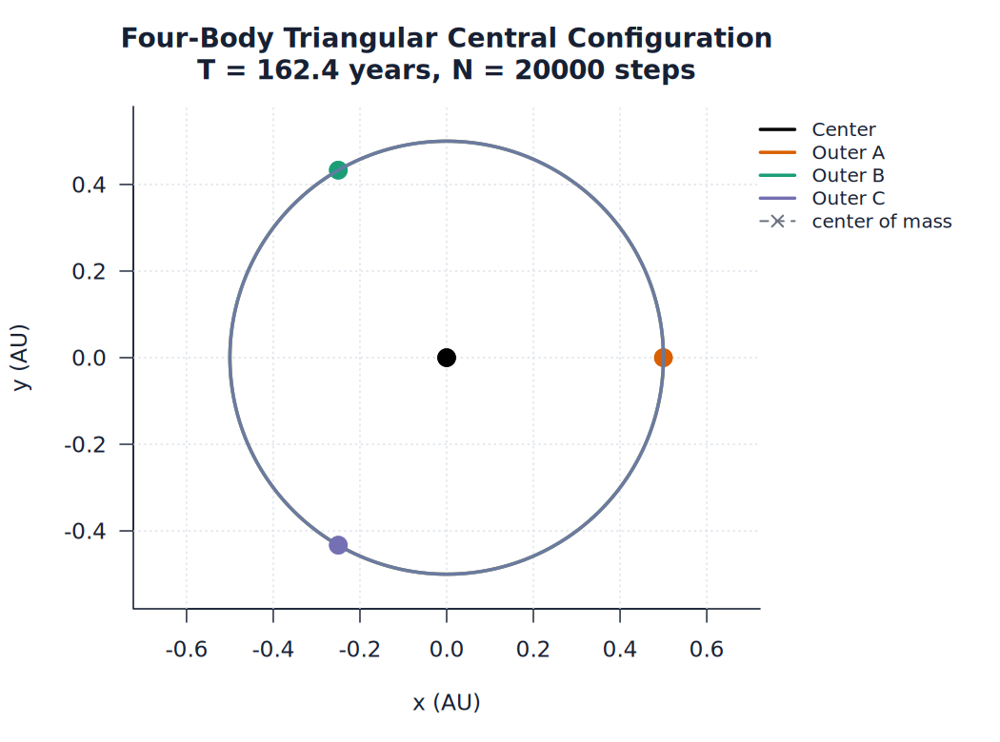

## Sun-Earth System

Our Sun and Earth files in the directory ```examples/two_body_examples/sun_earth_examples/```, each plot the orbit of the Earth (blue line) around the Sun (red) over $25$ years, using a different iteration method.
The simulation initializes Earth $1 AU$ along the x-axis from the Sun at the origin.
We use a high number of steps, $N=1000$, to maximize integration accuracy.
$25$ years is chosen because it spans multiple orbital periods and exposes long-term integration errors.

### Euler Method

The Euler Method does not illustrate the full $25$ periods.
The Earth also spirals out immediately, conserving very little total mechanical energy - leading to rapid orbital divergence.
Therefore, the Euler method is not an accurate technique, so methods with a higher-order or greater resolution are required to trace-out celestial dynamics better.
Euler fails due to accumulating first-order errors that destabilize the system rapidly, especially in energy-conserving dynamics like orbital motion.

Below is the code output which includes the energy ratio:
```
Two-Body System Simulation Euler Method Results:
Body a mass: 1.99e+30 kg
Body b mass: 5.97e+24 kg
Total simulation time: 25.00 years
Time steps: 1000
Time step size: 9.13 days
Initial separation: 1.000 AU
Final separation: 10.296 AU
Energy conservation ratio: 0.145946
```

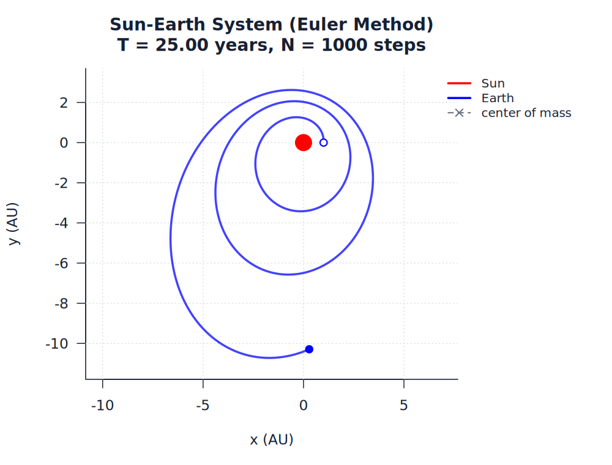

### Midpoint Method

Output:
```
Two-Body System Simulation Midpoint Method Results:
Body a mass: 1.99e+30 kg
Body b mass: 5.97e+24 kg
Total simulation time: 25.00 years
Time steps: 1000
Time step size: 9.13 days
Initial separation: 1.000 AU
Final separation: 1.055 AU
Energy conservation ratio: 0.942958
```

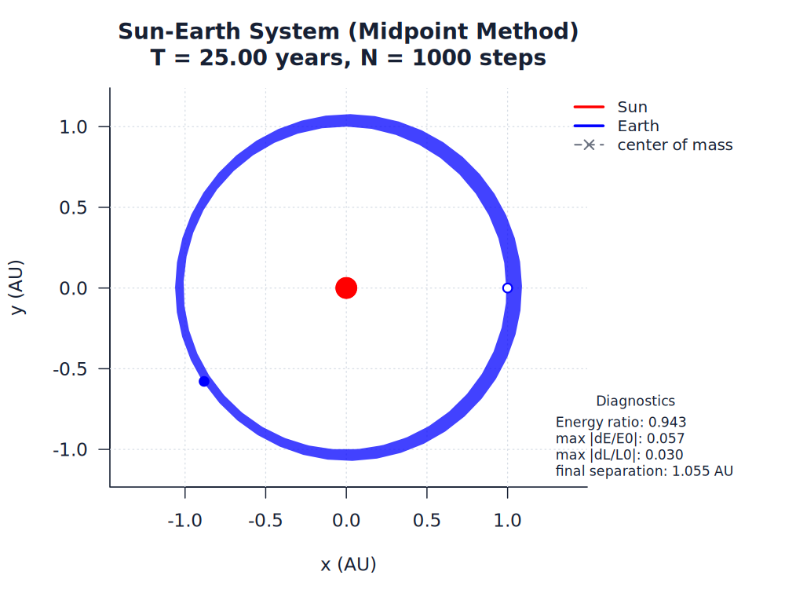

### Heun's Method

Heun’s method shows slightly less accuracy than the midpoint method in terms of final orbital radius and energy conservation.
$\approx 15%$ of total energy is lost after $25$ years, compared to $\approx 6%$ for the midpoint method.

Output:
```
Two-Body System Simulation Heun's Method Results:
Body a mass: 1.99e+30 kg
Body b mass: 5.97e+24 kg
Total simulation time: 25.00 years
Time steps: 1000
Time step size: 9.13 days
Initial separation: 1.000 AU
Final separation: 1.219 AU
Energy conservation ratio: 0.849014
```

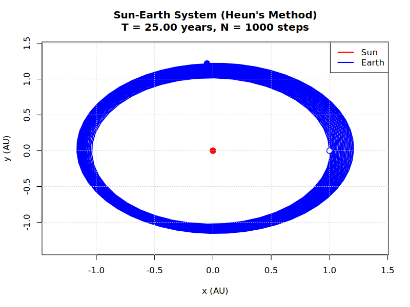

### Runge-Kutta Method

The most accurate technique by far, as the orbit shows no noticeable perturbations or shifts.

Output:
```
Two-Body System Simulation Runge-Kutta Method Results:
Body a mass: 1.99e+30 kg
Body b mass: 5.97e+24 kg
Total simulation time: 25.00 years
Time steps: 1000
Time step size: 9.13 days
Initial separation: 1.000 AU
Final separation: 1.000 AU
Energy conservation ratio: 1.000422
```

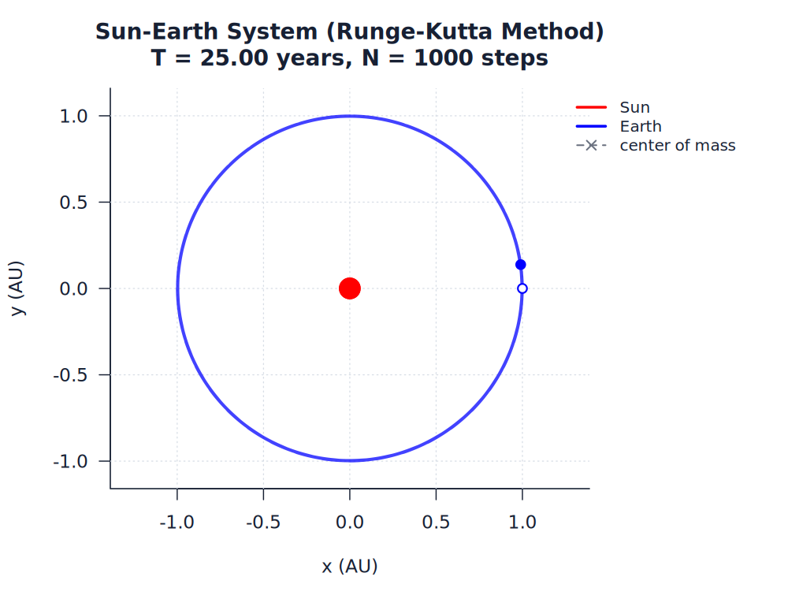

### Velocity Verlet Method

Velocity Verlet is a second-order symplectic method.
For the Sun-Earth example it keeps the orbit close to circular and preserves
energy well over the same 25-year horizon.
Its main value is long-term qualitative stability: even when RK4 has a smaller
local error, Verlet is often a better baseline for conservative orbital systems.

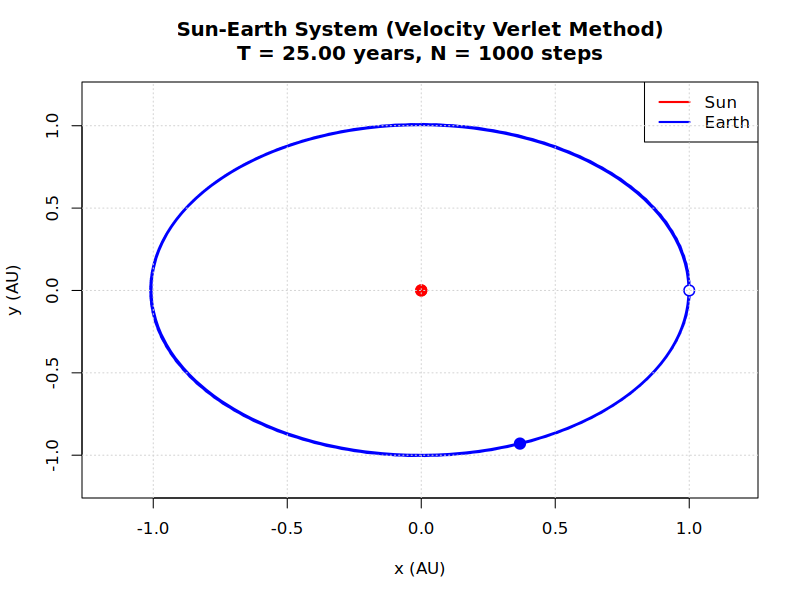

## Three-Body Systems

We used the RK4 method for the three-body systems for accuracy.
The example scripts are grouped under `examples/three_body_examples/` by model type:
`general/`, `special_solutions/`, `perturbations/`, and `restricted/`.

### Sun, Earth and Mars

Below illustrates the orbits of both the Earth and Mars around the Sun over a year.
As the planets are far away enough, and as the sun is a lot more massive, the orbits appear to be stable until errors in the Runge-Kutta method cause the system to spiral.

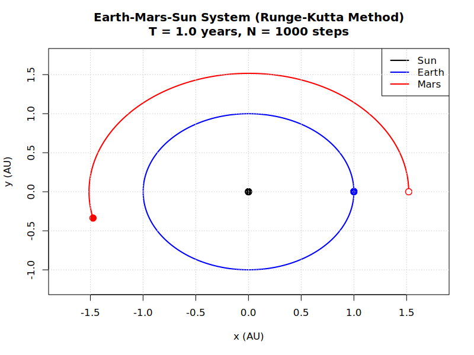

### Earth, Moon and Spacecraft

Another example illustrates an orbiting spacecraft between the Earth and moon.
The spacecraft appears to have an unstable orbit because it is so much lighter than the celestials.
Making small changes in the spacecraft's initial position and velocity drastically changes its orbit.
For longer periods of time, the spacecraft escapes the Earth–Moon system due to unstable gravitational perturbations.

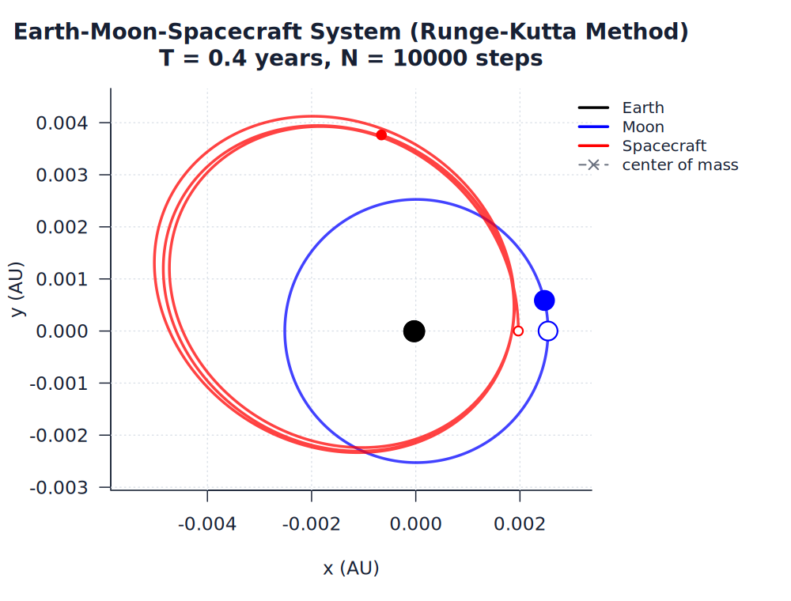

### Figure-8 Solution

A stable solution to the three-body problem exists where three identical massive bodies follow each other in a figure-8 pattern.
Each body trails the previous by one-third of the orbital period, forming a periodic figure-8 path "choreography".

The simulation uses standard dimensionless initial conditions for the equal-mass figure-8 orbit and scales them into SI units for three Earth-mass bodies.
For an initial outer-body separation of $1 AU$, one full figure-8 period is about $205.4$ years.

With the corrected scaling, RK4 returns the bodies to their starting separations after one period.
The energy output is ```Energy conservation ratio: 1.000000```, so this example validates the periodic figure-8 setup rather than demonstrating immediate destabilization.


### Lagrange Equilateral Solution

The Lagrange solution places three equal masses at the vertices of an equilateral triangle.
The whole triangle rotates around its center of mass while preserving all three pairwise separations.

For a side length of $1 AU$ between three Earth-mass bodies, one full period is about $333.2$ years.
RK4 returns each pairwise separation to $1 AU$ after one period, with output ```Energy conservation ratio: 1.000000```.

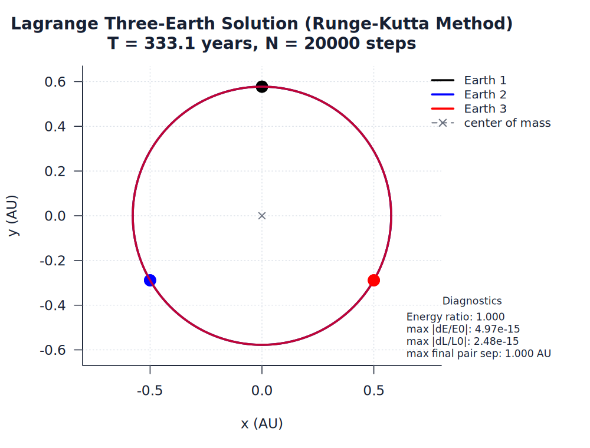

### Euler Collinear Solution

The Euler collinear solution places three equal masses along one rotating line, with one body at the center of mass and two bodies on opposite sides.
This configuration is more delicate than the Lagrange triangle because the bodies remain aligned throughout the orbit.

For an outer-body separation of $1 AU$, one full period is about $182.5$ years.
RK4 returns the adjacent separations to $0.5 AU$ and the outer separation to $1 AU$ after one period, with output ```Energy conservation ratio: 1.000000```.

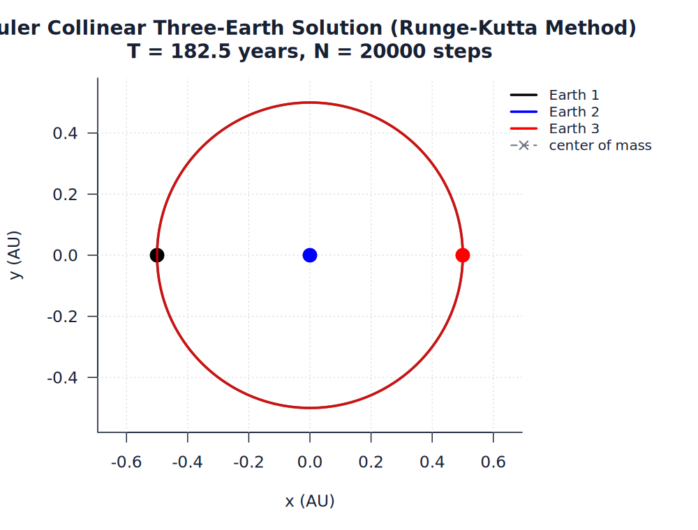

### Perturbed Special Solutions

Small perturbations were added to the figure-8 and Lagrange solutions.
The figure-8 perturbation changes one initial velocity component by $2%$ and is run over three nominal periods.
The Lagrange perturbation shifts one body by $0.002 AU$ and produces much larger shape changes over two periods.

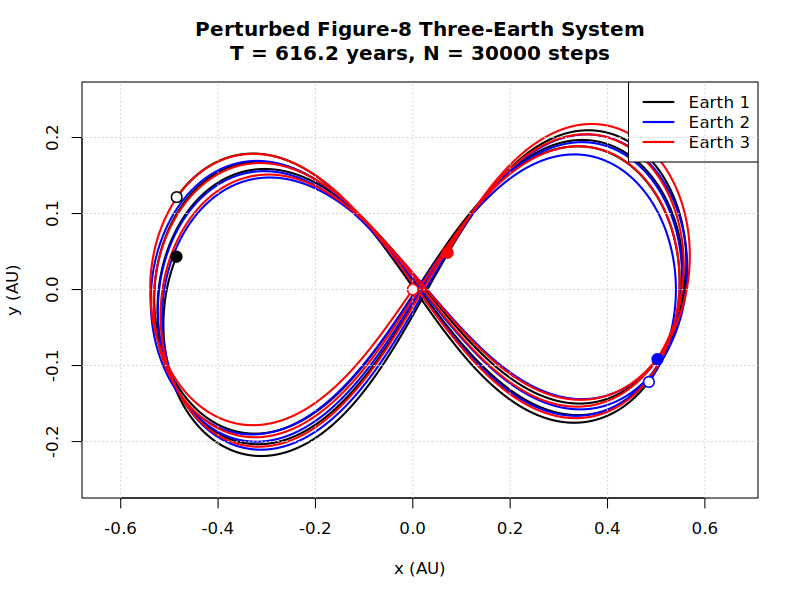

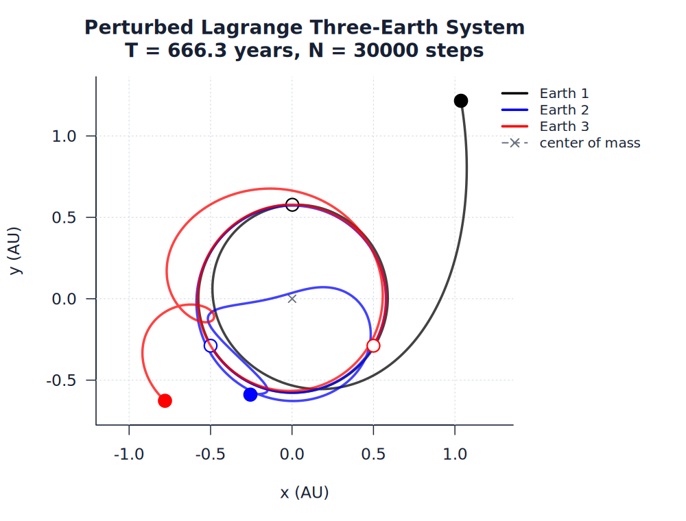

### Restricted Earth-Moon Trojan

The restricted Earth-Moon example uses normalized CR3BP coordinates.
The third body starts near L4, producing a Trojan-style tadpole trajectory in the rotating frame.

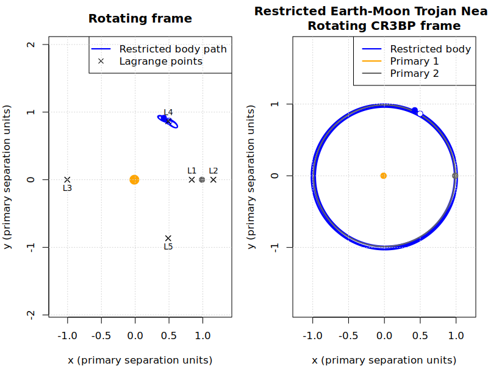

### Planar Lyapunov-Like L1 Orbit

The L1 example uses the CR3BP helper and starts near the Earth-Moon L1 point.
It is an illustrative planar Lyapunov-like trajectory in the rotating frame, not a corrected mission-grade halo orbit.

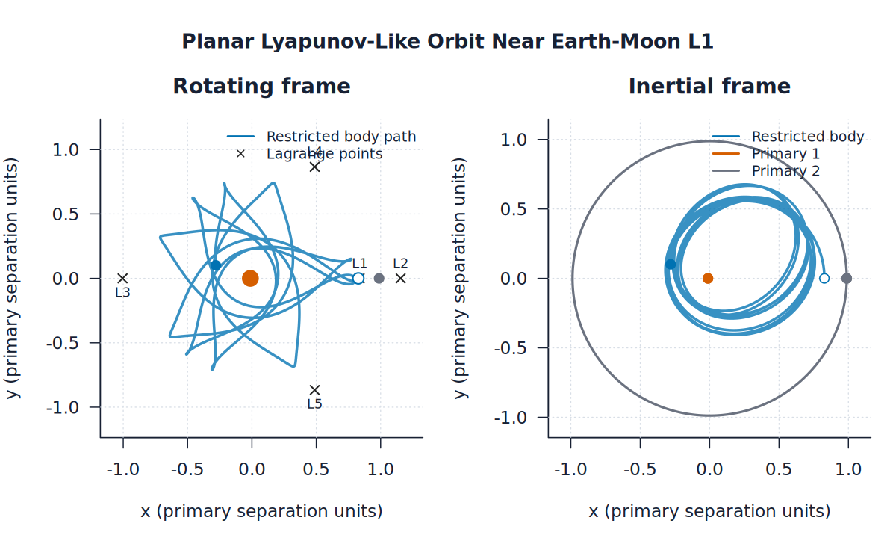

### Sitnikov Problem

The Sitnikov example uses two equal primaries in circular motion and a restricted third body moving perpendicular to their orbital plane.
The plot shows the vertical oscillation of the third body over time.

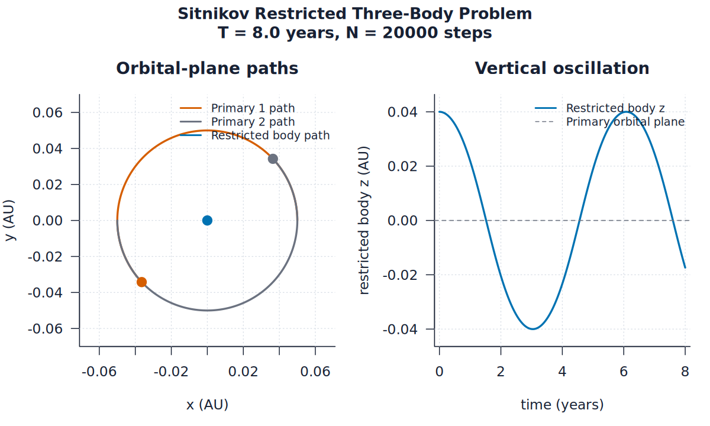

### Binary with a Distant Third Body

The hierarchical triple example places two solar-mass stars in a close binary and a Jupiter-mass body on a much wider outer orbit.
Over five years, the binary separation remains close to $0.2 AU$ while the third body traces a wider path around the pair.

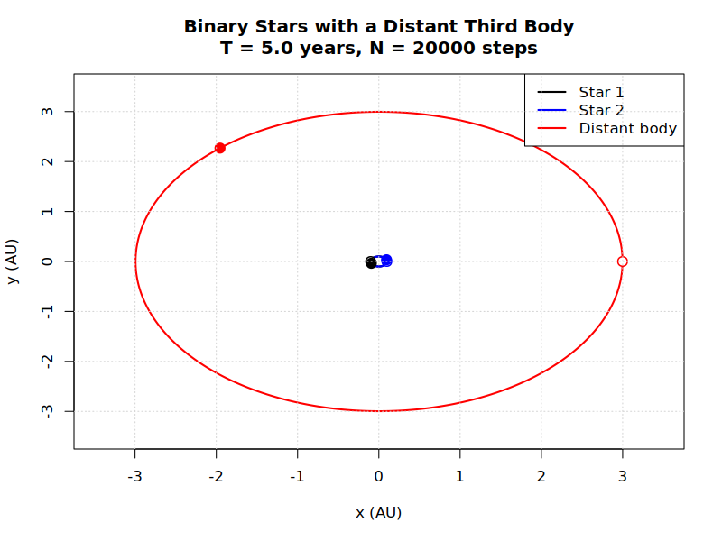

### Butterfly I Choreography

The Butterfly I choreography uses published dimensionless equal-mass initial conditions and scales them to three Earth-mass bodies with an outer separation of $1 AU$.
It needs a finer step count than the figure-8 example; with $N=100000$, RK4 returns the starting separations after one period with output ```Energy conservation ratio: 1.000026```.

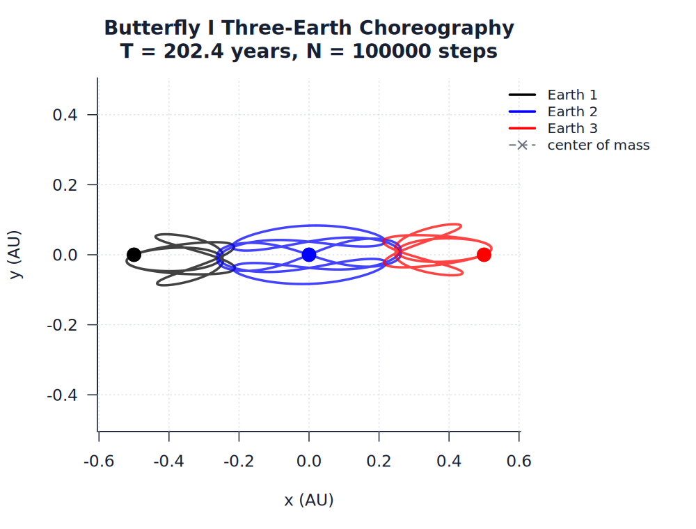

## Conclusions:
- The Euler method lost $\approx 85%$ for our Sun-Earth simulation - making it the least accurate.
- The Runge-Kutta (RK4) method is the most accurate, changing energy by as little as $\approx 0.04%$ for the same sytem.
- Velocity Verlet gives a symplectic comparison method with bounded long-term energy behavior for orbital systems.
- Many three-body systems are unstable, and at least one body can eventually be lost in generic simulations.
- The equal-mass figure-8, Lagrange triangle, Euler collinear, and Butterfly I cases are special periodic solutions; small perturbations can still grow over time.
- Restricted examples are useful for Lagrange points, Trojans, Lyapunov-like motion, and the Sitnikov problem without requiring a fully massive third body.

## References

- [Euler Method](https://en.m.wikipedia.org/wiki/Euler_method)
- [Midpoint Method](https://en.m.wikipedia.org/wiki/Midpoint_method)
- [Heun's Method](https://en.wikipedia.org/wiki/Heun%27s_method)
- [Runge-Kutta Method](https://en.m.wikipedia.org/wiki/Runge–Kutta_methods)
- [Figure-8 Solution](https://en.m.wikipedia.org/wiki/Three-body_problem) A special solution where three equal-mass bodies follow each other in a stable figure-8 path — discovered by Cris Moore (1993) and proven by Montgomery & Chenciner (2000).
- [Lagrange and Euler Solutions](https://en.m.wikipedia.org/wiki/Three-body_problem) Classical central-configuration solutions where the triangle or line rotates while retaining its shape.
- [Periodic Three-Body Initial Conditions](https://three-body.ipb.ac.rs/initial-conditions.pdf) Cataloged equal-mass periodic orbit initial conditions, including Butterfly I.

---

📘 Author: Sid Richards (SidRichardsQuantum)

 LinkedIn: https://www.linkedin.com/in/sid-richards-21374b30b/

This project is licensed under the MIT License - see the [LICENSE](LICENSE) file for details.
