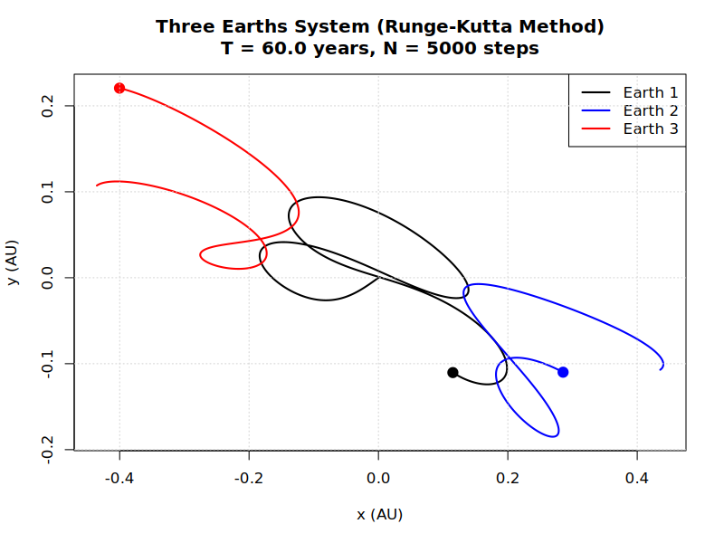

# Results

## Earth-Moon System

Our Earth and moon example files in ```examples/two_body_examples``` each plot the orbit of the moon (grey line) around the Earth (blue) over $10$ lunar months ($\approx 29.5$ days), using a different iteration method.
We set a high number of time-steps to maximise accuracy.

### Euler Method

The Euler Method only illustrates $\approx 3.25$ full orbits instead of $10$.
The moon also spirals out immediately.
Therefore, the Euler method is not an accurate technique, so methods with a higher-order or greater resolution are required to trace-out celestial dynamics better.


### Midpoint Method

$10$ periods are given


### Heun's Method


### Runge-Kutta Method


## Three Earths System



---

📘 Author: Sid Richards (SidRichardsQuantum)

 LinkedIn: https://www.linkedin.com/in/sid-richards-21374b30b/

This project is licensed under the MIT License - see the [LICENSE](LICENSE) file for details.
