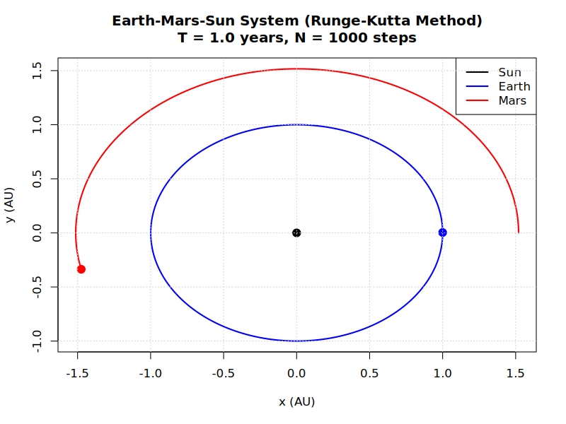

# Results

## Sun-Earth System

Our Sun and Earth example files in ```examples/two_body_examples``` each plot the orbit of the Earth (blue line) around the Sun (red) over $25$ years, using a different iteration method.
We use a high number of steps $N=1000$ to maximise technique accuracy.

### Euler Method

The Euler Method does not illustrate the full $25$ periods.
The Earth also spirals out immediately and not a lot of total energy is conserved.
Therefore, the Euler method is not an accurate technique, so methods with a higher-order or greater resolution are required to trace-out celestial dynamics better.

Output:
```
Two-Body System Simulation Euler Method Results:
Body a mass: 1.99e+30 kg
Body b mass: 5.97e+24 kg
Total simulation time: 25.00 years
Time steps: 1000
Time step size: 9.13 days
Initial separation: 1.000 AU
Final separation: 10.296 AU
Energy conservation ratio: 0.145946
```


### Midpoint Method

Output:
```
Two-Body System Simulation Midpoint Method Results:
Body a mass: 1.99e+30 kg
Body b mass: 5.97e+24 kg
Total simulation time: 25.00 years
Time steps: 1000
Time step size: 9.13 days
Initial separation: 1.000 AU
Final separation: 1.055 AU
Energy conservation ratio: 0.942958
```


### Heun's Method

Output:
```
Two-Body System Simulation Heun's Method Results:
Body a mass: 1.99e+30 kg
Body b mass: 5.97e+24 kg
Total simulation time: 25.00 years
Time steps: 1000
Time step size: 9.13 days
Initial separation: 1.000 AU
Final separation: 1.219 AU
Energy conservation ratio: 0.849014
```


### Runge-Kutta Method

Output:
```
Two-Body System Simulation Runge-Kutta Method Results:
Body a mass: 1.99e+30 kg
Body b mass: 5.97e+24 kg
Total simulation time: 25.00 years
Time steps: 1000
Time step size: 9.13 days
Initial separation: 1.000 AU
Final separation: 1.000 AU
Energy conservation ratio: 1.000422
```


## Three-Body Systems

We will use the RK4 method for the three-body systems for accuracy.

### Sun, Earth and Mars



### Earth, Moon and Spacecraft


### Three Earths


---

📘 Author: Sid Richards (SidRichardsQuantum)

 LinkedIn: https://www.linkedin.com/in/sid-richards-21374b30b/

This project is licensed under the MIT License - see the [LICENSE](LICENSE) file for details.
