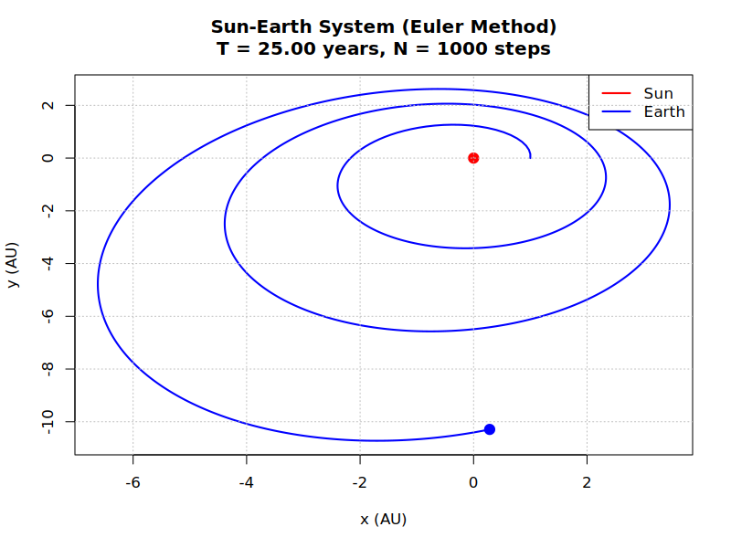

# Results

## Table of Contents

- [Sun-Earth System](#sun-earth-system)
  - [Euler Method](#euler-method)
  - [Midpoint Method](#midpoint-method)
  - [Heun's Method](#heuns-method)
  - [Runge-Kutta Method](#runge-kutta-method)
- [Three-Body Systems](#three-body-systems)
  - [Sun, Earth and Mars](#sun-earth-and-mars)
  - [Earth, Moon and Spacecraft](#earth-moon-and-spacecraft)
  - [Figure-8 Solution Attempt](#figure-8-solution-attempt)
- [Conclusions](#conclusions)
- [References](#references)

## Sun-Earth System

Our Sun and Earth files in the directory ```examples/two_body_examples/sun_earth_examples/```, each plot the orbit of the Earth (blue line) around the Sun (red) over $25$ years, using a different iteration method.
The simulation initializes Earth $1 AU$ along the x-axis from the Sun at the origin.
We control a high number of steps $N=1000$ to maximise technique accuracy.
$25$ years is chosen as it spans multiple orbital periods and exposes long-term integration errors..

### Euler Method

The Euler Method does not illustrate the full $25$ periods.
The Earth also spirals out immediately, conserving very little total mechanical energy - leading to rapid orbital divergence.
Therefore, the Euler method is not an accurate technique, so methods with a higher-order or greater resolution are required to trace-out celestial dynamics better.
Euler fails due to accumulating first-order errors that destabilize the system rapidly, especially in energy-conserving dynamics like orbital motion.

Below is the code output which includes the energy ratio:
```
Two-Body System Simulation Euler Method Results:
Body a mass: 1.99e+30 kg
Body b mass: 5.97e+24 kg
Total simulation time: 25.00 years
Time steps: 1000
Time step size: 9.13 days
Initial separation: 1.000 AU
Final separation: 10.296 AU
Energy conservation ratio: 0.145946
```



### Midpoint Method

Output:
```
Two-Body System Simulation Midpoint Method Results:
Body a mass: 1.99e+30 kg
Body b mass: 5.97e+24 kg
Total simulation time: 25.00 years
Time steps: 1000
Time step size: 9.13 days
Initial separation: 1.000 AU
Final separation: 1.055 AU
Energy conservation ratio: 0.942958
```


### Heun's Method

Heun’s method shows slightly less accuracy than the midpoint method in terms of final orbital radius and energy conservation.
$\approx 15%$ of total energy is lost after $25$ years, compared to $\approx 6%$ for the midpoint method.

Output:
```
Two-Body System Simulation Heun's Method Results:
Body a mass: 1.99e+30 kg
Body b mass: 5.97e+24 kg
Total simulation time: 25.00 years
Time steps: 1000
Time step size: 9.13 days
Initial separation: 1.000 AU
Final separation: 1.219 AU
Energy conservation ratio: 0.849014
```


### Runge-Kutta Method

The most accurate technique by far, as the orbit shows no noticeable perturbations or shifts.

Output:
```
Two-Body System Simulation Runge-Kutta Method Results:
Body a mass: 1.99e+30 kg
Body b mass: 5.97e+24 kg
Total simulation time: 25.00 years
Time steps: 1000
Time step size: 9.13 days
Initial separation: 1.000 AU
Final separation: 1.000 AU
Energy conservation ratio: 1.000422
```


## Three-Body Systems

We used the RK4 method for the three-body systems for accuracy.

### Sun, Earth and Mars

Below illustrates the orbits of both the earth and mars around the sun, over a year.
As the planets are far away enough, and as the sun is a lot more massive, the orbits appear to be stable until errors in the Runge-Kutta method cause the system to spiral.


### Earth, Moon and Spacecraft

Another example illustrates an orbiting spacecraft between the Earth and moon.
The spacecraft appears to have an unstable orbit because it is so much lighter than the celestials.
Making small changes in the spacecraft's initial position and velocity drastically changes its orbit.
For longer periods of time, the spacecraft escapes the Earth–Moon system due to unstable gravitational perturbations.


### Figure-8 Solution Attempt

A stable solution to the three-body problem exists where three identical massive bodies follow each other in a figure-8 pattern.
Each body trails the previous by one-third of the orbital period, forming a periodic figure-8 path "choreography".

We used the Python file ```celestial_systems/three_body/figure_8_solution.py``` to minimise the Lagrangian describing three identical masses each $T/3$ apart - giving the required initial parameters.

Because three-body problems are extremely sensitive to perturbations in initial conditions, the masses start to derail from the figure-8 pattern almost instantly.
The energy output is ```Energy conservation ratio: 1.004923```, which suggests that even though the RK4 method is extremely accurate - the solution quickly destabilizes.


## Conclusions:
- The Euler method lost $\approx 85%$ for our Sun-Earth simulation - making it the least accurate.
- The Runge-Kutta (RK4) method is the most accurate, changing energy by as little as $\approx 0.04%$ for the same sytem.
- Three-body systems are often unstable as at least one body is eventually lost in our simulations.
- Systems of three similar-sized masses are hyper-sensitive to small changes in initial conditions.

## References

- [Euler Method](https://en.m.wikipedia.org/wiki/Euler_method)
- [Midpoint Method](https://en.m.wikipedia.org/wiki/Midpoint_method)
- [Heun's Method](https://en.wikipedia.org/wiki/Heun%27s_method)
- [Runge-Kutta Method](https://en.m.wikipedia.org/wiki/Runge–Kutta_methods)
- [Figure-8 Solution](https://en.m.wikipedia.org/wiki/Three-body_problem) A special solution where three equal-mass bodies follow each other in a stable figure-8 path — discovered by Cris Moore (1993) and proven by Montgomery & Chenciner (2000).

---

📘 Author: Sid Richards (SidRichardsQuantum)

 LinkedIn: https://www.linkedin.com/in/sid-richards-21374b30b/

This project is licensed under the MIT License - see the [LICENSE](LICENSE) file for details.
