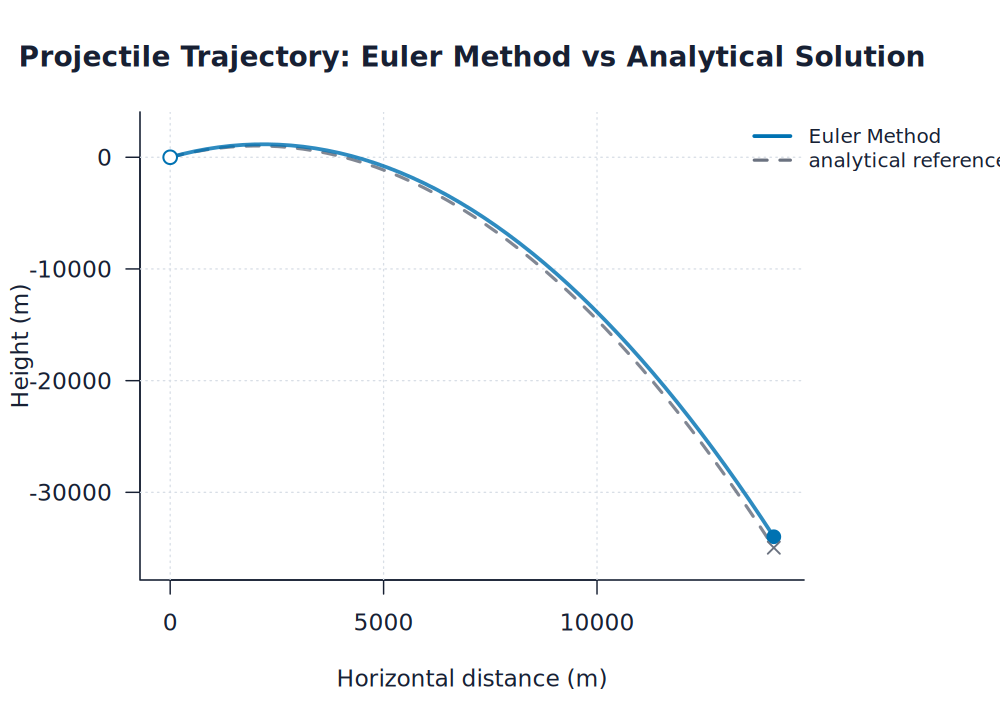
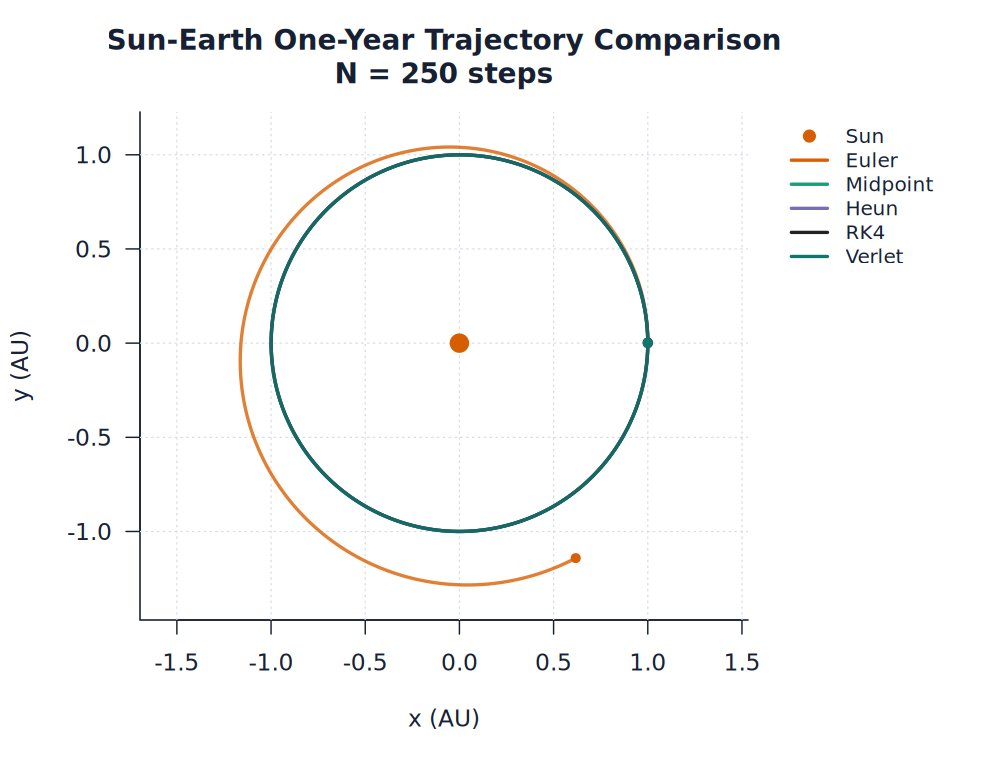
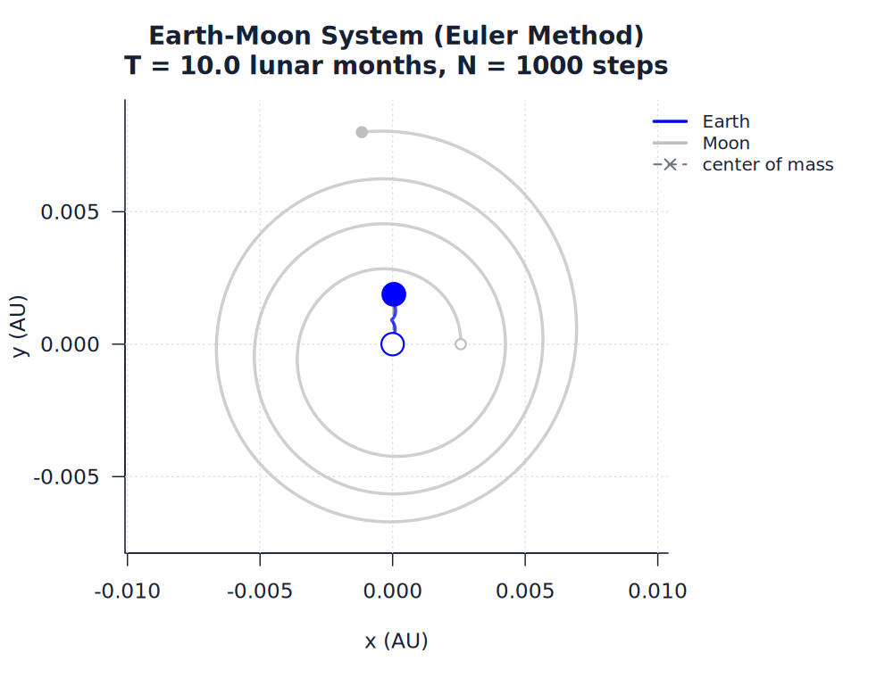
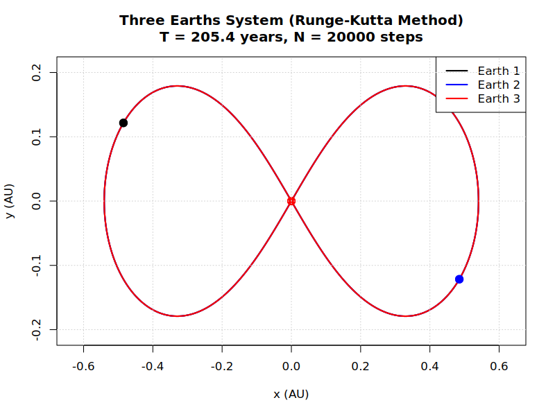
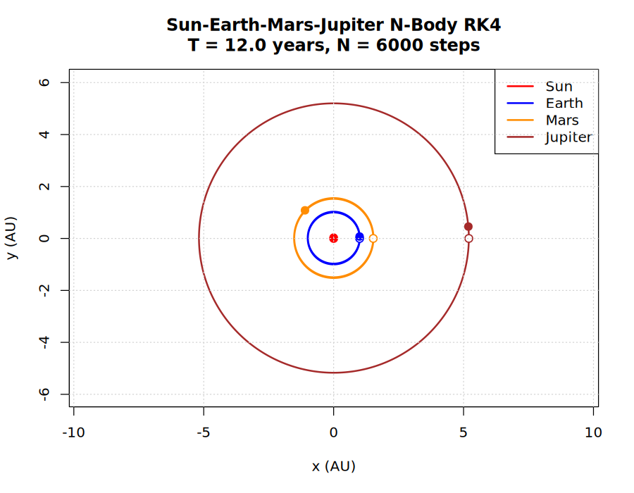
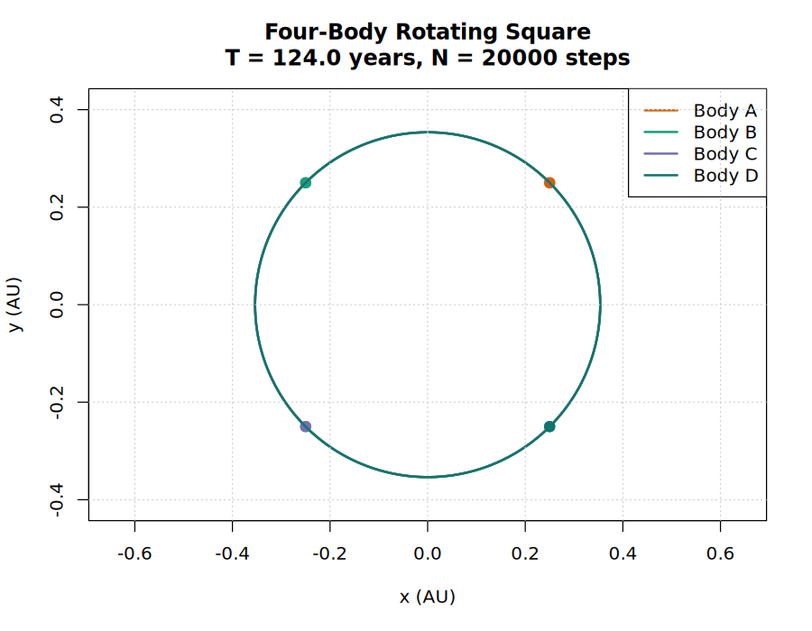

# Usage

## Installation

Install the development package directly from GitHub:

```r
install.packages("remotes")
remotes::install_github("SidRichardsQuantum/Celestial_Dynamics_Iteration_Methods")
```

After R-universe has built the package, install from R-universe:

```r
options(repos = c(
  sidrichardsquantum = "https://sidrichardsquantum.r-universe.dev",
  CRAN = "https://cloud.r-project.org"
))
install.packages("CelestialDynamicsIterationMethods")
```

R-universe setup notes and the registry details are in
[docs/R_UNIVERSE.md](R_UNIVERSE.md).

For source checkouts:

```bash
git clone https://github.com/SidRichardsQuantum/Celestial_Dynamics_Iteration_Methods.git
cd Celestial_Dynamics_Iteration_Methods
```

The R examples use base R. The optional Python helper
`R/systems/three_body/figure_8_solution.py` requires packages listed in
`requirements.txt`:

```bash
python -m pip install -r requirements.txt
```

## Common Commands

Run all validation checks:

```bash
Rscript tests/run_all_tests.R
```

Run three-body validation only:

```bash
Rscript tests/validate_three_body.R
```

Run two-body validation only:

```bash
Rscript tests/validate_two_body.R
```

Regenerate every example plot and companion trajectory animation:

```bash
Rscript run_all_examples.R
```

Regenerate the Sun-Earth all-method comparison only:

```bash
Rscript examples/comparisons/sun_earth_all_methods.R
```

Regenerate generated result tables, conservation diagnostics, runtime
benchmarks, convergence plots, the plot manifest, the results index, and the
method comparison dashboard:

```bash
Rscript analysis/generate_results.R
```

Update the committed artifact size/dimension baseline after intentional plot or
dashboard changes:

```bash
Rscript analysis/update_artifact_baseline.R
```

Open the generated local results index in a browser:

```text
analysis/generated/index.html
```

The published GitHub Pages version is:

```text
https://sidrichardsquantum.github.io/Celestial_Dynamics_Iteration_Methods/
```

Regenerate two-body plots only:

```bash
Rscript examples/two_body/run_all_two_body_examples.R
```

Regenerate n-body plots only:

```bash
Rscript examples/n_body/run_all_n_body_examples.R
```

Regenerate three-body plots only:

```bash
Rscript examples/three_body/run_all_three_body_examples.R
```

Run examples from the repository root so their `source(...)` paths resolve correctly.

Repository scripts bootstrap `R/load.R`, then use `cd_source()` or the
module-level helpers such as `cd_load_two_body()` and `cd_load_three_body()`.
Use those helpers for new scripts instead of adding long chains of direct
`source("R/...")` calls.

The repository also has lightweight R package metadata (`DESCRIPTION` and
`NAMESPACE`). This supports package build/load checks while preserving the
script-driven example and artifact workflow.

Build and check the internal package surface:

```bash
R CMD build . --no-build-vignettes --no-manual
R CMD check CelestialDynamicsIterationMethods_*.tar.gz --no-manual --ignore-vignettes
```

The package namespace is intentionally conservative for now: functions are
loaded for package checks, but stable public exports should be added only after
the API is deliberately chosen.

Run the experimental near-periodic three-body search:

```bash
Rscript experiments/find_three_body_solution.R
```

This search is intentionally exploratory. It performs a small randomized search over symmetric equal-mass initial conditions and writes a candidate plot to `images/three_body/experiments/candidate_solution.png`.

## Example Usage

Projectile trajectory:

```r
source("examples/projectile/projectile_example.R")
```



Sun-Earth all-method comparison:

```r
source("examples/comparisons/sun_earth_all_methods.R")
```



Earth-Moon system using Euler's method:

```r
source("examples/two_body/earth_moon/earth_moon_euler.R")
```



Equal-mass figure-8 three-body solution:

```r
source("examples/three_body/special_solutions/three_earths.R")
```



Four-body Sun-Earth-Mars-Jupiter example:

```r
source("examples/n_body/sun_earth_mars_jupiter.R")
```



Special four-body rotating square:

```r
source("examples/n_body/special_solutions/rotating_square_four_body.R")
```



## Project Structure

```text
Celestial_Dynamics_Iteration_Methods/
├── DESCRIPTION
├── NAMESPACE
├── README.md
├── docs/USAGE.md
├── docs/THEORY.md
├── docs/RESULTS.md
├── R/constants.R
├── run_all_examples.R
├── analysis/
│   ├── README.md
│   ├── generate_results.R
│   ├── update_artifact_baseline.R
│   └── generated/
│       ├── artifact_baseline.csv
│       ├── convergence_summary.csv
│       ├── earth_moon_method_summary.csv
│       ├── index.html
│       ├── method_summary.csv
│       ├── method_comparison_dashboard.html
│       ├── n_body_conservation_summary.csv
│       ├── plot_manifest.csv
│       ├── runtime_benchmark.csv
│       └── three_body_special_summary.csv
├── .github/
│   └── workflows/
│       ├── pages.yml
│       ├── r-validation.yml
│       └── regenerate-plots.yml
├── R/systems/
│   ├── plotting/
│   │   └── plot_style.R
│   ├── two_body/
│   │   ├── plot_two_body.R
│   │   ├── two_body_helpers.R
│   │   ├── two_body_method_registry.R
│   │   ├── two_body_euler.R
│   │   ├── two_body_heuns.R
│   │   ├── two_body_midpoint.R
│   │   ├── two_body_runge_kutta.R
│   │   └── two_body_velocity_verlet.R
│   ├── n_body/
│   │   ├── four_body_initial_conditions.R
│   │   ├── n_body_helpers.R
│   │   ├── n_body_runge_kutta.R
│   │   ├── n_body_velocity_verlet.R
│   │   └── plot_n_body.R
│   └── three_body/
│       ├── choreography_initial_conditions.R
│       ├── circular_restricted_three_body.R
│       ├── euler_collinear_initial_conditions.R
│       ├── figure_8_initial_conditions.R
│       ├── figure_8_solution.py
│       ├── lagrange_initial_conditions.R
│       ├── plot_three_body.R
│       ├── sitnikov_problem.R
│       └── three_body_runge_kutta.R
├── examples/
│   ├── README.md
│   ├── comparisons/
│   ├── n_body/
│   │   ├── run_all_n_body_examples.R
│   │   └── special_solutions/
│   ├── projectile/
│   ├── two_body/
│   │   ├── run_all_two_body_examples.R
│   │   ├── earth_moon/
│   │   └── sun_earth/
│   └── three_body/
│       ├── README.md
│       ├── run_all_three_body_examples.R
│       ├── general/
│       ├── perturbations/
│       ├── restricted/
│       └── special_solutions/
├── images/
│   ├── analysis/
│   ├── n_body/
│   ├── projectile/
│   ├── two_body/
│   └── three_body/
├── experiments/
│   └── find_three_body_solution.R
├── R/methods/
└── tests/
    ├── helpers_three_body.R
    ├── run_all_tests.R
    ├── validate_plot_generation.R
    ├── validate_restricted_three_body.R
    ├── validate_special_solutions.R
    ├── validate_two_body.R
    └── validate_three_body.R
```

## Generated Artifacts

Plots are generated artifacts, but this repository keeps representative PNGs under `images/` so the markdown result pages render directly.
Trajectory examples also write companion HTML canvas animations next to the PNGs.
If an example is changed, run the relevant example runner and then run:

```bash
Rscript tests/validate_plot_generation.R
```

The GitHub Actions workflow `R validation` runs `tests/run_all_tests.R` on pushes and pull requests.
The `Regenerate plots` workflow is manual; it runs `run_all_examples.R`, regenerates analysis artifacts, validates the outputs, and uploads regenerated image and analysis directories as artifacts.
The `Deploy GitHub Pages` workflow regenerates plots, animations, and analysis artifacts, validates them, and publishes a static site containing `analysis/generated/`, `images/`, `README.md`, and `docs/`.

The generated comparison dashboard is written to:

```text
analysis/generated/method_comparison_dashboard.html
```

The generated results index is written to:

```text
analysis/generated/index.html
```

The plot manifest and artifact baseline used by validation are written to:

```text
analysis/generated/plot_manifest.csv
analysis/generated/artifact_baseline.csv
```

Representative generated animations include:

```text
images/two_body/sun_earth/sun_earth_runge_kutta.html
images/three_body/special_solutions/three_earths.html
images/n_body/sun_earth_mars_jupiter.html
```
